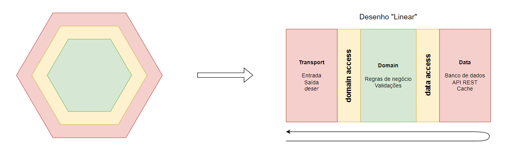

# _credit-card_ - Service de gestão de cartões de crédito

## Principais recursos

- Solicitar criação de cartões
- Consulta de extrato
- Consulta de limite
- Registro de cobrança (em uma ou múltiplas parcelas)
- Fechamento de fatura
- Pagamento de fatura

## Principais regras

- Para poder criar um cartão de crédito, um usuário precisa ser aprovado pelo service de anti-fraud. (Verificar _cURL_ abaixo)
  - Caso ele seja aprovado, uma conta deve ser criada para ele utilizando o service de account-management ANTES do cartão de crédito ser gerado. (Verificar _cURL_ abaixo)
- Para pagar a fatura do cartão, a conta do dono do cartão deve estar com o saldo no mínimo igual ao valor da fatura.
- O valor da compra nunca pode ser maior do que o limite disponível no cartão.
- O maior número de parcelas permitido para uma operação de compra é 12 (Valor mínimo para parcelamento: R$ 6.00).
  - Regra de distribuição: Valor Compra (VC) / Número parcelas (NP) distribuídos de maneira (mês + NP)
    - Ex: Compra de R$ 200.00 realizada em janeiro, em 4 vezes, precisa gerar 4 operações de cobrança de R$ 50.00 para Jan, Fev, Mar, Abr.
- Pode existir somente uma fatura por mês. Caso a fatura seja fechada antes do final do mês, todas operações devem ser geradas para o próximo mês.

## Mapa de entidades (DB)

### Credit Card Entity

| Campo                  | Tipo        | Descrição                |
|------------------------|-------------|--------------------------|
| id                     | varchar(32) | Chave primária (UUID)    |
| owner                  | varchar(11) | CPF do dono do cartão    |
| number                 | varchar(16) | Número do cartão         |
| security_code          | varchar(3)  | Código de segurança      |
| printed_name           | varchar(25) | Nome impresso            |
| credit_limit           | double      | Limite total             |
| available_credit_limit | double      | Limite disponível        |
| created_at             | timestamp   | Data/hora de criação     |
| updated_at             | timestamp   | Data/hora de atualização |

### Credit Card Operation Entity

| Campo       | Tipo        | Descrição                                   |
|-------------|-------------|---------------------------------------------|
| id          | varchar(32) | Chave primária (UUID)                       |
| credit_card | varchar(32) | Referência fraca ao cartão de crédito       |
| type        | varchar(10) | Tipo de operação (Compra/Estorno/Pagamento) |
| value       | double      | Valor da operação                           |
| description | text        | Descrição da operação                       |
| month       | int         | Mês em que deve ser cobrada a operação      |
| year        | int         | Ano em que deve ser cobrada a operação      |
| created_at  | timestamp   | Data/hora da operação                       |

### Credit Card Invoice Entity

| Campo       | Tipo        | Descrição                                                            |
|-------------|-------------|----------------------------------------------------------------------|
| id          | varchar(32) | Chave primária                                                       |
| credit_card | varchar(32) | Referência fraca ao cartão de crédito                                |
| month       | int         | Indicador de mês                                                     |
| year        | int         | Indicador de ano                                                     |
| value       | double      | Valor da fatura                                                      |
| created_at  | timestamp   | Data/hora da criação da fatura                                       |
| paid_at     | timestamp?  | Data/hora do pagamento da fatura (nulo se ainda não tiver sido paga) |

## Norte da arquitetura



## Observações sobre os outros services

Ambos funcionam somente com storage em memória, então quando você reiniciar o docker, todos os dados serão removidos da base.

## Executando o programa

**Importante:** Não se esqueça de configurar o JDK do projeto com a versão 11.


Após a configuração da JDK, suba o container do docker utilizando o comando abaixo:
```shell
docker-compose up -d  
```

Agora, basta utilizar a task ``bootRun`` para iniciar o servidor:


Quando terminar, é uma boa prática "descer" o container do docker, você pode fazer isso utilizando:
```shell
docker-compose down  
```

# cURLs para outros services

Esse service se comunica com 2 micros-services já mapeados para rodar junto do seu docker. Aqui estão os cURLs necessários para se comunicar os services.

#### Anti-fraud - Consultando eligibilidade para cartão de crédito
```shell
curl --location --request GET 'http://localhost:7444/anti-fraud/credit-card-eligibility/{taxId}'
```

#### Account-manager - Criando conta
```shell
curl --location --request POST 'http://localhost:7445/account-management/create' \
--header 'Content-Type: application/json' \
--data-raw '{
    "taxId": "{taxId}"
}'
```

#### Account-manager - Consultando saldo por ID de conta
```shell
curl --location --request GET 'http://localhost:7445/account-management/balance/{accountId}'
```

#### Account-manager - Consultando saldo por CPF
```shell
curl --location --request GET 'http://localhost:7445/account-management/balance-by-tax-id/{taxId}'
```

#### Account-manager - Depositando dinheiro em conta
```shell
curl --location --request PUT 'http://localhost:7445/account-management/deposit' \
--header 'Content-Type: application/json' \
--data-raw '{
    "accountId": "{accountId}",
    "amount": 1500.00
}'
```

#### Account-manager - Retirando dinheiro de uma conta
```shell
curl --location --request PUT 'http://localhost:7445/account-management/withdraw' \
--header 'Content-Type: application/json' \
--data-raw '{
    "accountId": "{accountId}",
    "amount": 300.0
}'
```

# Utilizando o Fuel

[Documentação oficial do Fuel](https://fuel.gitbook.io/documentation/core/fuel)

#### Exemplo de GET:
```kotlin
fun getAllBooks(): List<Book> {
    val (_, result, response) = Fuel.get("$baseUrl/books").responseObject<List<Book>>(jacksonDeserializerOf())
    return if (result.isSuccessful) {
        response.get()
    } else throw RuntimeException("Não deu boa pra consultar os livros :/")
}
```

#### Exemplo de POST:
```kotlin
fun createBook(bookCreationRequest: BookCreationRequest): Book {
    val (_, result, response) = Fuel.post("$baseUrl/books").objectBody(bookCreationRequest).responseObject<Book>(jacksonDeserializerOf())
    return if (result.isSuccessful) {
        response.get()
    } else throw RuntimeException("Não deu boa pra cadastrar o novo livro :'(")
}
```

#### Data classes envolvidas no exemplo:
```kotlin
data class BookCreationRequest(
    val title: String, 
    val author: String, 
    val pages: Int,
)

data class Book(
    val bookId: String,
    val title: String,
    val author: String,
    val pages: Int,
)
```
ou seja...
```json
{
  "title": "Whatever",
  "author": "Incognitowski",
  "pages": 200
}
```
```json
{
  "bookId": "2C9N8RCAJ2N3HR",
  "title": "Whatever",
  "author": "Incognitowski",
  "pages": 200
}
```